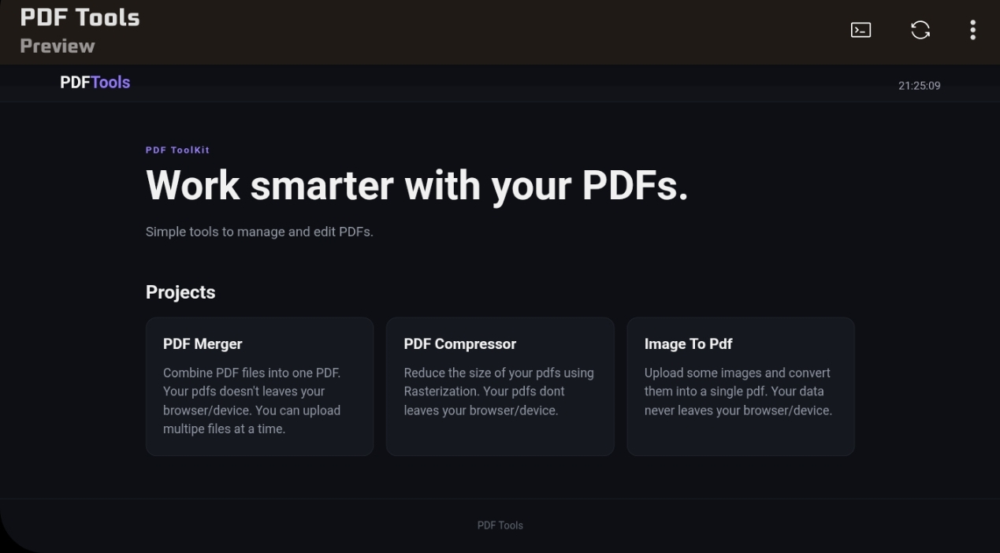

# PDF TOOLS
---

---
This is a simple web app with useful Pdf tools built with html css and js.

it has a home screen where all tools can be accessed. Now it has 3 tools. In later ships more tools will be added.

## PDF Merger
---
Merge multiple pdfs into a single one directly from browser.

### Features
- Select multiple Pdfs at once
- add more pdfs later
- remove files if needed

## PDF Compressor
---
Reduce the size of pdf using rasterization. It has different levels low medium and high to control the file size.

### Features
- None of your data never leaves your browser/device
- There might need a small compromise in the quality. when reducing more size.
- The pdf pages are converted into jpeg and recombined.

## IMAGE TO PDF
---
Upload many images and pack them as a single pdf. Using jsPdf library.

### Features 
- You can upload multiple files at once.
- None of your data never leaves your device.
- Images are converted to pdf without any compromise in quality.

## Tech used 
---
- HTML
- CSS
- JS
- GITHUB PAGES
- PDF-lib.js
- PDF worker.js
- jsPdf.js

## Live at 
https://pdf.devlkakkoth.me